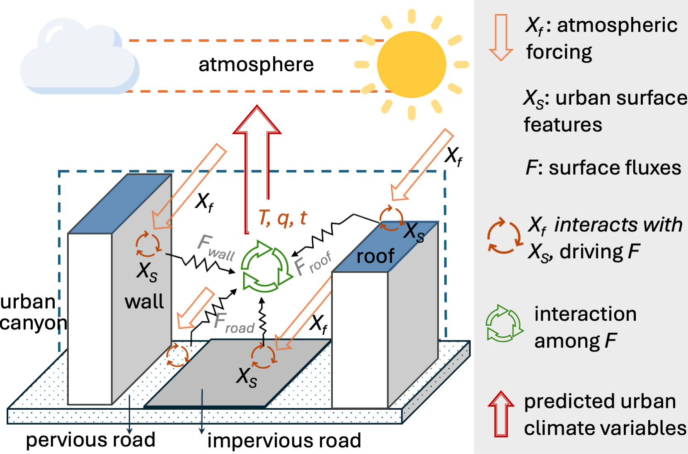

# **(NeurIPS'2025) Learning Urban Climate Dynamics via Physics-Guided Urban Surface–Atmosphere Interactions**

### Authors: **Jiyang Xia***, Fenghua Ling, Zhenhui Jessie Li, Junjie Yu, Hongliang Zhang, David O. Topping, Lei Bai, Zhonghua Zheng



## Introduction

The objectives of this project are:

- Leverage data-dirven methods  to represent the interaction between urban surface and the atmopheric forcing.
- Incorpate **physical and domian knowledge** to models for enchanced modelling.
- Investigate the **generalization** and **multi-task** capabilities of physics-guide models and their potential as urban climate **foundation models**.


## Description

```python
├── baseline    # baseline models
├── checkpoints # download or save models' checkpoints here
├── config      # model hyperparameters
├── data        # data-driven atomsphere data used for metrics calculation. 
├── image   
├── main        # UCformer training, inference, and generaliza
├── README.md
├── src         # UCformer code
├── utils       # tools
└── requirments.txt   
```

### Checkpoints:

Model weights are available at Hugging Face, and the link goes [here](https://huggingface.co/XiGuaaa/ucformer). You would like to download these models and put them in the right place.

### Datasets:

The datasets leveraged for model development are hosted on Hugging Face, and the link goes [here](https://huggingface.co/datasets/XiGuaaa/ucformer_dataset).

The data catalog structure is as follows:

- nc: this folder contains the raw `.nc` file for simulations, atmospheric forcings, and urban surface features.
- Processed: this folder contains the `.parquet` file sourced from the corresponding `.nc` files, which are used for model development and evaluation.

The dataset statistics that you'll need to run the experiments are already saved in the `./code_UCformer/data` directory.

##  Environment Setup

We recommend installing in a virtual environment from PyPi or Conda. Then, run:

```python
# conda
conda create -n yourenv python==3.10.13
conda activate yourenv
pip install -r requirements.txt
```

## Running experiments

### **Training UCformer:**

```python
python ./code_UCformer/main/train.py --datapath /your/data/path/
```

Note: download the `ucformer_dataset/processed/` to `/your/data/path/` and specify their path after `--datapath`

### **Inference:**

Download [Model checkpoints](https://huggingface.co/XiGuaaa/ucformer) to the `./code_UCformer/checkpoints/` directory.

> **UCformer**

```python
python ./code_UCformer/main/inference.py --datapath /your/data/path/
```

> **MLP_CSB**

```python
python ./code_UCformer/baseline/MLP_CSB/inference.py --datapath /your/data/path/
```

> **Transformer**

```python
python ./code_UCformer/baseline/Transformer/inference.py --datapath /your/data/path/
```

> **LSTNet_modified**

```python
python ./code_UCformer/baseline/LSTnet/src/inference.py --datapath /your/data/path/
```

> **Informer_modified**

```python
python ./code_UCformer/baseline/Informer/inference.py --datapath /your/data/path/
```

### Generalize to urban future climate dynamics (2070-2074 datasets)

Note: download the `ucformer_dataset/processed/2070-2074_generalize/` to `/your/data/path/` 

> **UCformer**

```python
python ./code_UCformer/main/generalization.py --datapath /your/data/path/
```

> **MLP_CSB**

```python
python ./code_UCformer/baseline/MLP_CSB/generalization.py --datapath /your/data/path/
```

> **Transformer**

```python
python ./code_UCformer/baseline/Transformer/generalization.py --datapath /your/data/path/
```

> **LSTNet_modified**

```python
python ./code_UCformer/baseline/LSTnet/src/generalization.py --datapath /your/data/path/
```

> **Informer_modified**

```python
python ./code_UCformer/baseline/Informer/generalization.py --datapath /your/data/path/
```

## Citation

```latex
@inproceedings{xia2025ucformer,
    title={Learning Urban Climate Dynamics via Physics-Guided Urban Surface\–Atmosphere Interactions},
    author={Jiyang_Xia and Fenghua Ling and Zhenhui Jessie Li and Junjie Yu and Hongliang Zhang and David Topping and LEI BAI and Zhonghua Zhengu},
    booktitle={The Thirty-Ninth Annual Conference on Neural Information Processing Systems},
    year={2025},
    url={https://openreview.net/forum?id=i9BjNoVjub&nesting=2&sort=date-desc}
}
```

